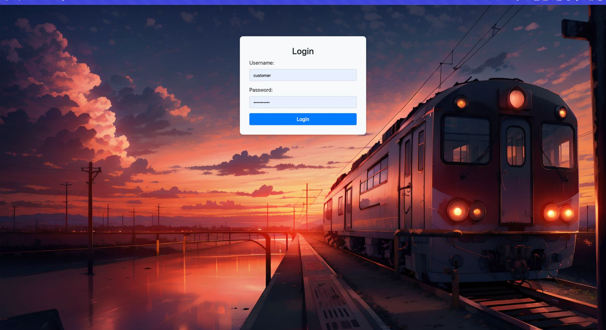
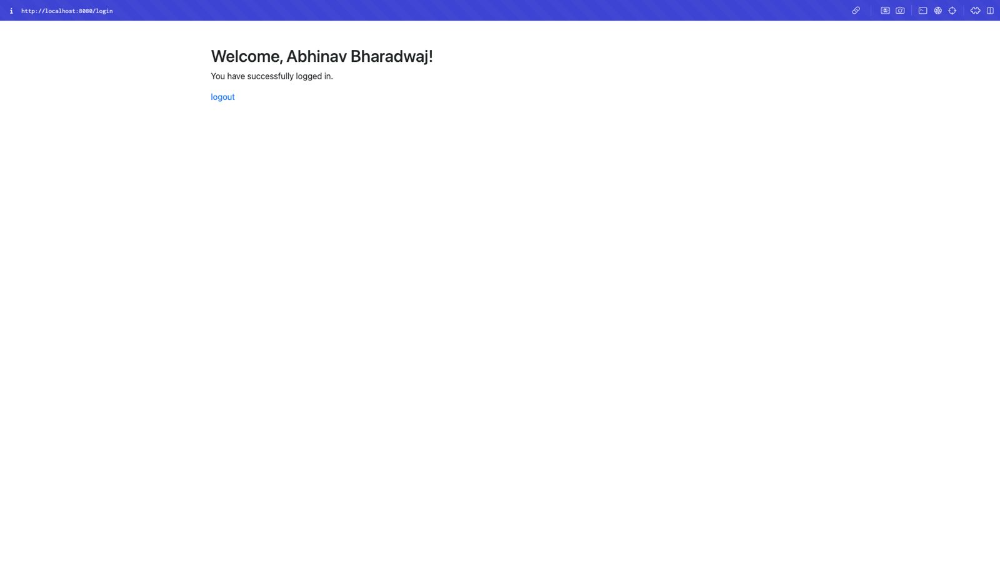
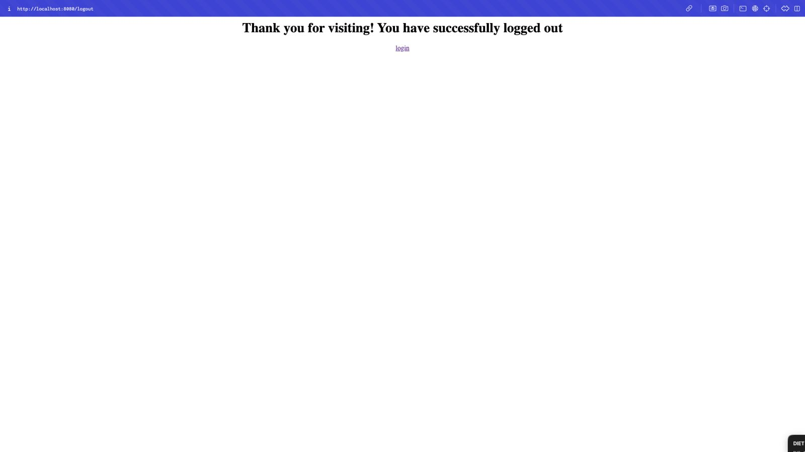

# Railway Booking System - User Login

## Members

- Manassa Jagannathan (mj900)
- Puja Sridhar (ps1393)
- Abhinav Bharadwaj Sarathy (ab2812)

## Overview

This project is a Railway Booking System that allows users to log in and book train tickets. The system is built using **Spring Boot**, **JSP**, and **MySQL**.

## Prerequisites

Before you begin, ensure you have the following software installed:

- **MySQL**: To run the database and execute the SQL scripts.
- **Spring Boot**: To run the application and serve the login page.
- **JDK**: Make sure Java Development Kit (JDK) is installed (JDK 8 or later).
- **Maven**: To manage project dependencies and build the application.

## Setup

### 1. Set Up MySQL Database

1. **Import the SQL Script**  
   The SQL script required to set up the database is located in the `sql/` folder of the project. Follow the steps below to set up your MySQL environment:

    - Open MySQL Workbench or your preferred MySQL client.
    - Execute the SQL script file located in the `sql/` folder:
        - Navigate to the `sql/` folder inside your project directory.
        - Open the script `create-database.sql` (or similar, depending on your naming).
        - Run the SQL script to create the necessary tables and insert the initial data into the MySQL database.

   **Example**:
   ```sql
   source /path/to/your/project/sql/create-database.sql;


2. **Update Application Properties**
    Make sure to update the application.properties (or application.yml) file in the src/main/resources directory with your MySQL connection details:

    **Sample**:
    ```properties
    spring.datasource.url=jdbc:mysql://localhost:3306/railway_booking_system
    spring.datasource.username=your_mysql_username
    spring.datasource.password=your_mysql_password
    spring.datasource.driver-class-name=com.mysql.cj.jdbc.Driver
    spring.jpa.hibernate.ddl-auto=update
    spring.jpa.database-platform=org.hibernate.dialect.MySQL8Dialect


## Run the application
### 1. Start the application

1. **Build the Application**
    Use Maven to build the Spring Boot application:

    ```bash
    mvn clean install

2. **Run the Application**
   Start the Spring Boot application by running the following command:

    ```bash
    mvn spring-boot:run
   
3. **If Maven is not installed**
   We also support maven wrapper, which does not require you to install Maven in your system.
   - For Windows
     - mvnw.cmd clean install to build the app
     - mvnw.cmd spring-boot:run to run the application
   - For macOS
     - ./mvnw clean install to build the app
     - ./mvnw spring-boot:run to run the application

The application should now be running at http://localhost:8080/.


### 3. Access the Login Page

- Open your browser and navigate to the following URL to access the login page:
  http://localhost:8080/login

## Login Credentials
To log in, use the following credentials:

- Username: customer
- Password: password123

## Troubleshooting

If you encounter any issues:

- Ensure that MySQL is running and the database credentials are correctly configured.
- Verify that the tables and initial data are set up correctly by checking the database after running the SQL script.
- Check the console logs for errors when running the Spring Boot application.
- Reach out to abhinavbharadwaj.sarathy@rutgers.edu

## Login/Logout Output (simple version)
1. **Login Page**


2. **Welcome Page**


3. **Logout Page**

